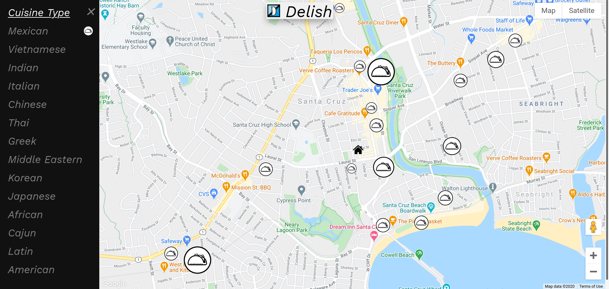
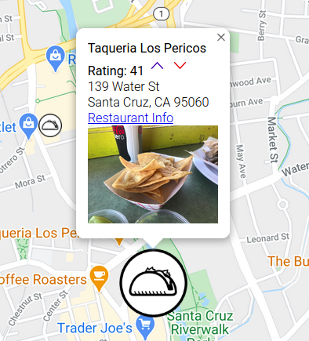

# Delish-Food
[Delish Food](https://delish-food-292917.web.app/) is a crowdsourced website designed to be intuitive and visually appealing. Our goal is to help you find the best ethnic food in your area. 

# Usage
https://delish-food-292917.web.app/ \
Simply visit our website and choose a category, or categories, of food you are craving.

# Icons and ratings
Delish Food uses crowdsourcing to let you know where the best places are to eat in your neighborhood. Places with larger icons are highly rated while places with smaller icons are rated less.

## Crowdsourcing
We need your help! When you find a good place to eat, add an upvote to your favorite place on the app! This will help others know where the best places are in town. 

# Tech
* Our website is hosted on Google Firebase.
* Populated maps data using Google Maps and Places API
* Our REST API is hosted by GCP endpoints.
* We used MongoDB Atlas as our database to store ratings.
